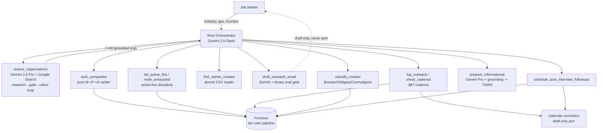

# Architecture — Advocate

Advocate is a multi-agent system on **Google ADK** with **Gemini on Vertex AI**,
deployed to **Cloud Run** (scale-to-zero) with **Firestore** for per-user state.

## Agent topology

A root orchestrator (Gemini 2.5 Flash) coordinates specialist capabilities, all exposed as
deterministic function tools over a pure-code core. `source_organizations` (Gemini 2.5 Pro)
runs Google Search grounding *inside* an iterative research → coverage-gate → refine loop,
enforcing the ≥40-org LAMP minimum in pure code.

## Layering

- **`advocate/core/`** — pure code, no LLM, fully unit-tested: the M→P→A `ranker`,
  `email_eval` (binary gate), `drafting` loop, `business_days` + `cadence`, `active_five`,
  `classification`, `tiara`, `guardrails`, `state` models.
- **`advocate/data/`** — `loaders` (CSV → models), the `repository` (in-memory + Firestore),
  `serialization`, and the runtime `repository_factory`.
- **`advocate/services/`** — `scheduler` (3B7 + follow-ups) and the `calendar_port`.
- **`advocate/agents/`** — the ADK agents and the thin function tools that wrap the core.
- **`agent_apps/advocate_app/`** — ADK discovery package (named to avoid shadowing the
  `advocate` library); `advocate/app.py` serves it on Cloud Run with Cloud Trace enabled.

## Why this shape

The riskiest judgment (sourcing, drafting, research) runs on Gemini; everything that must
be **deterministic and provable** — ranking, the 3B7 date math, the active-five invariant,
the email compliance gate — is pure Python with full unit coverage. The LLM proposes; the
code enforces.

## Deployment

- **Project:** `agenticprd` · **Region:** `us-central1`
- **Service:** Cloud Run `advocate`, runs as a dedicated least-privilege SA
  (`advocate-run`, roles `datastore.user` + `aiplatform.user`).
- **State:** Firestore named database `advocate`, path `users/{user_id}/companies/{company}`.
- **Budget:** $50 billing alert at 50/90/100%.
